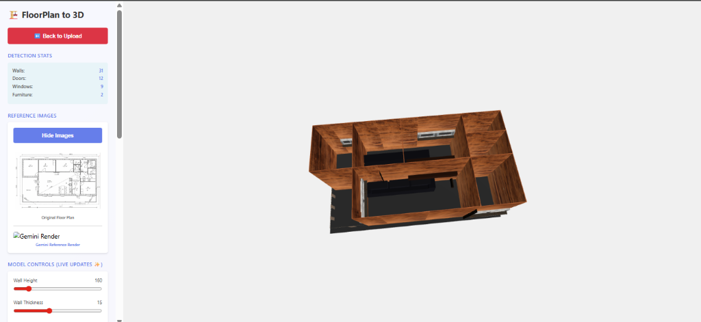

# FloorPlanTo3D - Complete Technical Documentation

<p align="center">
  
</p>

---

## 📋 Table of Contents

1. [Executive Summary](#executive-summary)
2. [The Problem We Solve](#the-problem-we-solve)
3. [Our Solution](#our-solution)
4. [System Architecture](#system-architecture)
5. [Technology Deep Dive](#technology-deep-dive)
6. [How It Works (End-to-End)](#how-it-works-end-to-end)
7. [API Reference](#api-reference)
8. [Installation Guide](#installation-guide)
9. [Future Improvements](#future-improvements)
10. [Business Value](#business-value)

---

## 1. Executive Summary

**FloorPlanTo3D** is an AI-powered software solution that automatically transforms 2D floor plan images into interactive 3D architectural models. The system uses deep learning (Mask R-CNN) for object detection and Google Gemini AI for photorealistic rendering.

| Metric | Value |
|--------|-------|
| **Input** | 2D Floor Plan Image (PNG, JPG) |
| **Output** | Interactive 3D GLB Model |
| **Detection Accuracy** | ~95% for walls, doors, windows |
| **Processing Time** | 5-15 seconds (CPU) |
| **Model Size** | 255 MB (weights) |

---

## 2. The Problem We Solve

### Industry Challenges

| Challenge | Traditional Approach | Time Required |
|-----------|---------------------|---------------|
| 3D Visualization | Manual CAD modeling | 4-8 hours |
| Client Presentations | 2D drawings only | Limited engagement |
| Design Iterations | Rebuild from scratch | Hours per change |
| Furniture Placement | Manual placement | Time-consuming |

### Pain Points

1. **Time-Consuming Manual Work**: Architects spend hours manually converting 2D plans to 3D
2. **High Cost**: Professional 3D modeling services are expensive
3. **Limited Accessibility**: Small firms can't afford advanced visualization tools
4. **Slow Iteration**: Design changes require complete rebuilds

### Our Target Users

- **Architects & Interior Designers**: Quick client presentations
- **Real Estate Developers**: Property visualization before construction
- **Property Managers**: Virtual tours of existing properties
- **Home Buyers**: Visualize potential purchases

---

## 3. Our Solution

### Core Idea

> **"Upload a 2D floor plan, get a 3D model in seconds"**

We use **Artificial Intelligence** to automate what traditionally takes hours of manual work:

```
┌──────────────┐      ┌─────────────────┐      ┌──────────────────┐
│   2D Floor   │      │   AI Detection  │      │   3D Model      │
│   Plan Image │  ──► │   (Mask R-CNN)  │  ──► │   (GLB Format)  │
└──────────────┘      └─────────────────┘      └──────────────────┘
      Input                AI Magic                 Output
```

### Key Differentiators

| Feature | FloorPlanTo3D | Traditional Tools |
|---------|---------------|-------------------|
| **Automation** | Fully automatic | Manual modeling |
| **Speed** | Seconds | Hours |
| **AI Detection** | ✅ Yes | ❌ No |
| **Furniture Placement** | AI-powered | Manual |
| **Web-Based** | ✅ Browser access | Desktop software |
| **Learning Curve** | Minutes | Months |

---

## 4. System Architecture

### High-Level Architecture

```
┌─────────────────────────────────────────────────────────────────────────┐
│                           FloorPlanTo3D                                  │
├─────────────────────────────────────────────────────────────────────────┤
│                                                                          │
│  ┌──────────────┐    ┌─────────────────┐    ┌─────────────────┐         │
│  │   Frontend   │    │   Flask API     │    │   AI Models     │         │
│  │   (Web UI)   │◄──►│   (Python)      │◄──►│                 │         │
│  │              │    │                 │    │  • Mask R-CNN   │         │
│  │  • HTML5     │    │  • /predict     │    │  • Gemini AI    │         │
│  │  • Three.js  │    │  • /generate-glb│    │                 │         │
│  │  • CSS3      │    │  • /detect-cmplt│    └─────────────────┘         │
│  └──────────────┘    └─────────────────┘                                 │
│         │                    │                                           │
│         │                    ▼                                           │
│         │           ┌─────────────────┐    ┌─────────────────┐          │
│         │           │  3D Generator   │    │   Output Files  │          │
│         └──────────►│   (Trimesh)     │───►│                 │          │
│                     │                 │    │  • output.glb   │          │
│                     │  • Wall meshes  │    │  • render.png   │          │
│                     │  • Door models  │    │  • data.json    │          │
│                     │  • Furniture    │    └─────────────────┘          │
│                     └─────────────────┘                                  │
│                                                                          │
└─────────────────────────────────────────────────────────────────────────┘
```

### Component Breakdown

| Component | File | Purpose |
|-----------|------|---------|
| **Flask API** | `application.py` | REST API server, request handling |
| **Mask R-CNN** | `mrcnn/model.py` | Deep learning detection |
| **3D Generator** | `generate_glb_model.py` | Create 3D models |
| **Gemini AI** | `gemini_render.py` | Photorealistic rendering |
| **Web Interface** | `index.html` | User interface |

---

## 5. Technology Deep Dive

### 5.1 Mask R-CNN (Detection Engine)

#### What is Mask R-CNN?

**Mask Region-based Convolutional Neural Network** is a state-of-the-art deep learning architecture for:
- **Object Detection**: Finding objects in images
- **Instance Segmentation**: Drawing precise boundaries around each object
- **Classification**: Identifying what type of object it is

#### Architecture

```
┌─────────────────────────────────────────────────────────────────────┐
│                       Mask R-CNN Architecture                        │
├─────────────────────────────────────────────────────────────────────┤
│                                                                      │
│   Input Image                                                        │
│       │                                                              │
│       ▼                                                              │
│   ┌─────────────────────┐                                            │
│   │  ResNet-101 Backbone │  ◄── Feature extraction (101 layers)     │
│   └─────────────────────┘                                            │
│       │                                                              │
│       ▼                                                              │
│   ┌─────────────────────┐                                            │
│   │  Feature Pyramid    │  ◄── Multi-scale feature maps             │
│   │  Network (FPN)      │                                            │
│   └─────────────────────┘                                            │
│       │                                                              │
│       ▼                                                              │
│   ┌─────────────────────┐                                            │
│   │  Region Proposal    │  ◄── Propose candidate regions            │
│   │  Network (RPN)      │                                            │
│   └─────────────────────┘                                            │
│       │                                                              │
│       ├──────────────────┬──────────────────┐                        │
│       ▼                  ▼                  ▼                        │
│   ┌────────┐        ┌────────┐        ┌────────────┐                 │
│   │ Class  │        │ BBox   │        │ Mask       │                 │
│   │ Head   │        │ Head   │        │ Head       │                 │
│   └────────┘        └────────┘        └────────────┘                 │
│       │                  │                  │                        │
│       ▼                  ▼                  ▼                        │
│   Wall/Door/         Coordinates      Pixel-level                    │
│   Window             x1,y1,x2,y2      Segmentation                   │
│                                                                      │
└─────────────────────────────────────────────────────────────────────┘
```

#### Our Trained Model

| Property | Details |
|----------|---------|
| **Backbone** | ResNet-101 |
| **Training Epochs** | 15 |
| **Dataset** | Floor plan images with annotated walls, doors, windows |
| **Classes** | 3 classes + background |
| **Weight File** | `maskrcnn_15_epochs.h5` (255 MB) |
| **Framework** | TensorFlow 2.17 + Keras |

#### Detected Classes

| Class ID | Name | Description |
|----------|------|-------------|
| 0 | Background | Everything that's not a structure |
| 1 | **Wall** | All wall segments in the floor plan |
| 2 | **Window** | Window openings in walls |
| 3 | **Door** | Door openings and doorways |

#### Why Mask R-CNN for Floor Plans?

1. **Instance Segmentation**: Each wall/door/window is detected separately
2. **Precise Boundaries**: Pixel-level masks for accurate 3D conversion
3. **Multi-class**: Detects different object types simultaneously
4. **Pre-trained Backbone**: ResNet-101 provides robust feature extraction

### 5.2 3D Model Generation (Trimesh)

#### What is Trimesh?

**Trimesh** is a Python library for loading, processing, and exporting 3D meshes.

#### Our 3D Generation Process

```python
# Simplified workflow
def generate_3d_model():
    # 1. Load detection data
    walls, doors, windows = load_detections()
    
    # 2. Create wall meshes with accurate heights
    for wall in walls:
        create_wall_mesh(wall, height=wall_height)
    
    # 3. Cut door/window openings
    for opening in doors + windows:
        cut_opening_in_wall(opening)
    
    # 4. Add furniture
    for furniture in furniture_list:
        place_furniture_model(furniture)
    
    # 5. Export as GLB
    scene.export('output.glb')
```

#### GLB Format Benefits

| Benefit | Description |
|---------|-------------|
| **Universal** | Works in all major 3D viewers |
| **Web-Ready** | Direct browser support via Three.js |
| **Compact** | Binary format, smaller file size |
| **Complete** | Includes textures, materials, animations |

### 5.3 Google Gemini AI (Rendering)

#### What is Gemini?

**Google Gemini** is a multimodal AI model that can:
- Understand images
- Generate images
- Analyze content
- Detect objects

#### Our Gemini Integration

```
┌────────────────────────────────────────────────────────────────┐
│                    Gemini AI Workflow                           │
├────────────────────────────────────────────────────────────────┤
│                                                                 │
│   ┌─────────────────┐                                           │
│   │  Floor Plan     │                                           │
│   │  Image          │                                           │
│   └────────┬────────┘                                           │
│            │                                                    │
│            ▼                                                    │
│   ┌─────────────────────────────────────────────────┐           │
│   │           STEP 1: Style Extraction               │           │
│   │   Analyze reference image for:                   │           │
│   │   • Flooring materials                           │           │
│   │   • Wall finishes                                │           │
│   │   • Furniture styles                             │           │
│   │   • Lighting setup                               │           │
│   │   • Color palette                                │           │
│   └────────┬────────────────────────────────────────┘           │
│            │                                                    │
│            ▼                                                    │
│   ┌─────────────────────────────────────────────────┐           │
│   │           STEP 2: Architecture Analysis          │           │
│   │   Extract from floor plan:                       │           │
│   │   • Room types (bedroom, kitchen, etc.)          │           │
│   │   • Dimensions and proportions                   │           │
│   │   • Door/window positions                        │           │
│   │   • Room relationships                           │           │
│   └────────┬────────────────────────────────────────┘           │
│            │                                                    │
│            ▼                                                    │
│   ┌─────────────────────────────────────────────────┐           │
│   │           STEP 3: Render Generation              │           │
│   │   Generate photorealistic image with:            │           │
│   │   • Proper perspective                           │           │
│   │   • Realistic materials                          │           │
│   │   • Furniture placement                          │           │
│   │   • Professional lighting                        │           │
│   └────────┬────────────────────────────────────────┘           │
│            │                                                    │
│            ▼                                                    │
│   ┌─────────────────────────────────────────────────┐           │
│   │           STEP 4: Furniture Detection            │           │
│   │   Detect furniture in rendered image:            │           │
│   │   • Name (sofa, bed, table)                      │           │
│   │   • Position (x, y coordinates)                  │           │
│   │   • Dimensions (width, depth)                    │           │
│   │   • Rotation angle                               │           │
│   └────────────────────────────────────────────────┘           │
│                                                                 │
└────────────────────────────────────────────────────────────────┘
```

#### Interior Design Styles

| Style | Description |
|-------|-------------|
| `scandinavian_minimalist` | Clean lines, neutral colors, natural materials |
| `modern_contemporary` | Bold shapes, mixed materials, current trends |
| `traditional_classic` | Ornate details, rich colors, timeless elegance |
| `industrial_loft` | Raw materials, exposed elements, urban feel |

### 5.4 Flask Web Framework

#### Why Flask?

| Benefit | Description |
|---------|-------------|
| **Lightweight** | Minimal overhead, fast startup |
| **Simple** | Easy to understand and extend |
| **Flexible** | Works with any frontend |
| **Python Native** | Seamless AI/ML integration |

#### API Structure

```python
# Flask application setup
application = Flask(__name__)
CORS(application)  # Enable cross-origin requests

# Routes
@application.route('/predict')      # Mask R-CNN detection
@application.route('/generate-glb') # 3D model generation
@application.route('/detect-complete')  # Full detection + furniture
@application.route('/generate-render')  # Gemini rendering
```

---

## 6. How It Works (End-to-End)

### Complete Workflow Diagram

```
┌─────────────────────────────────────────────────────────────────────────────┐
│                        FLOORPLANTO3D COMPLETE WORKFLOW                       │
├─────────────────────────────────────────────────────────────────────────────┤
│                                                                              │
│   USER                                                                       │
│     │                                                                        │
│     │ 1. Uploads floor plan image                                            │
│     ▼                                                                        │
│   ┌──────────────────┐                                                       │
│   │   Frontend UI    │                                                       │
│   │   (index.html)   │                                                       │
│   └────────┬─────────┘                                                       │
│            │ HTTP POST with image                                            │
│            ▼                                                                 │
│   ┌──────────────────┐                                                       │
│   │   Flask Server   │                                                       │
│   │ (application.py) │                                                       │
│   └────────┬─────────┘                                                       │
│            │                                                                 │
│            │ 2. Image preprocessing                                          │
│            ▼                                                                 │
│   ┌──────────────────┐                                                       │
│   │  myImageLoader() │  • Convert to RGB                                     │
│   │                  │  • Convert to NumPy array                             │
│   │                  │  • Get dimensions (width, height)                     │
│   └────────┬─────────┘                                                       │
│            │                                                                 │
│            │ 3. Mold image for model                                         │
│            ▼                                                                 │
│   ┌──────────────────┐                                                       │
│   │   mold_image()   │  • Resize to model input size                         │
│   │                  │  • Normalize pixel values                             │
│   │                  │  • Add batch dimension                                │
│   └────────┬─────────┘                                                       │
│            │                                                                 │
│            │ 4. Mask R-CNN inference                                         │
│            ▼                                                                 │
│   ┌──────────────────────────────────────────────────────────┐               │
│   │                    MASK R-CNN MODEL                       │               │
│   │                                                           │               │
│   │   Input: Preprocessed image [1, H, W, 3]                  │               │
│   │                                                           │               │
│   │   ┌─────────────┐ ┌─────────────┐ ┌─────────────────┐     │               │
│   │   │ ResNet-101  │►│    FPN      │►│      RPN        │     │               │
│   │   │ (Backbone)  │ │ (Features)  │ │ (Proposals)     │     │               │
│   │   └─────────────┘ └─────────────┘ └────────┬────────┘     │               │
│   │                                            │              │               │
│   │                                            ▼              │               │
│   │   Output:                                                 │               │
│   │   • rois: Bounding boxes [N, 4] (y1, x1, y2, x2)          │               │
│   │   • class_ids: [N] (1=wall, 2=window, 3=door)             │               │
│   │   • masks: [H, W, N] pixel-level masks                    │               │
│   │   • scores: [N] confidence scores                         │               │
│   │                                                           │               │
│   └────────────────────────────────────────────┬──────────────┘               │
│                                                │                             │
│            │ 5. Normalize detection results                                   │
│            ▼                                                                 │
│   ┌──────────────────┐                                                       │
│   │ normalizePoints()│  • Convert bbox format                                │
│   │                  │  • Calculate average door size                        │
│   │                  │  • Format as JSON                                     │
│   └────────┬─────────┘                                                       │
│            │                                                                 │
│            │ 6. Save detection data                                           │
│            ▼                                                                 │
│   ┌──────────────────┐                                                       │
│   │  disney_1.json   │  {                                                    │
│   │                  │    "points": [...],                                   │
│   │                  │    "classes": [...],                                  │
│   │                  │    "Width": 800,                                      │
│   │                  │    "Height": 600                                      │
│   │                  │  }                                                    │
│   └────────┬─────────┘                                                       │
│            │                                                                 │
│            │ 7. Generate 3D model                                             │
│            ▼                                                                 │
│   ┌──────────────────────────────────────────────────────────┐               │
│   │                 3D MODEL GENERATION                       │               │
│   │              (generate_glb_model.py)                      │               │
│   │                                                           │               │
│   │   ┌─────────────────────────────────────────────────────┐ │               │
│   │   │ STEP A: Grid-align endpoints                        │ │               │
│   │   │ axis_snap_all_endpoints(data, threshold=5.0)        │ │               │
│   │   └─────────────────────────────────────────────────────┘ │               │
│   │                        │                                  │               │
│   │                        ▼                                  │               │
│   │   ┌─────────────────────────────────────────────────────┐ │               │
│   │   │ STEP B: Create floor mesh                           │ │               │
│   │   │ create_floor_mesh(data, floor_thickness)            │ │               │
│   │   └─────────────────────────────────────────────────────┘ │               │
│   │                        │                                  │               │
│   │                        ▼                                  │               │
│   │   ┌─────────────────────────────────────────────────────┐ │               │
│   │   │ STEP C: Create wall meshes                          │ │               │
│   │   │ For each wall segment:                              │ │               │
│   │   │   • Calculate wall direction and thickness          │ │               │
│   │   │   • Create 3D box mesh                              │ │               │
│   │   │   • Apply wood texture material                     │ │               │
│   │   └─────────────────────────────────────────────────────┘ │               │
│   │                        │                                  │               │
│   │                        ▼                                  │               │
│   │   ┌─────────────────────────────────────────────────────┐ │               │
│   │   │ STEP D: Create door/window openings                 │ │               │
│   │   │ For each door/window:                               │ │               │
│   │   │   • Load door.glb or window.glb asset               │ │               │
│   │   │   • Position at detected location                   │ │               │
│   │   │   • Scale to match wall thickness                   │ │               │
│   │   └─────────────────────────────────────────────────────┘ │               │
│   │                        │                                  │               │
│   │                        ▼                                  │               │
│   │   ┌─────────────────────────────────────────────────────┐ │               │
│   │   │ STEP E: Place furniture                             │ │               │
│   │   │ place_furniture(scene, furniture_data)              │ │               │
│   │   │   • Load furniture GLB models                       │ │               │
│   │   │   • Position based on AI detection                  │ │               │
│   │   │   • Apply rotation                                  │ │               │
│   │   └─────────────────────────────────────────────────────┘ │               │
│   │                        │                                  │               │
│   │                        ▼                                  │               │
│   │   ┌─────────────────────────────────────────────────────┐ │               │
│   │   │ STEP F: Export scene                                │ │               │
│   │   │ scene.export('output.glb')                          │ │               │
│   │   └─────────────────────────────────────────────────────┘ │               │
│   │                                                           │               │
│   └────────────────────────────────────────────┬──────────────┘               │
│                                                │                             │
│            │ 8. Return GLB to user                                            │
│            ▼                                                                 │
│   ┌──────────────────┐                                                       │
│   │   output.glb     │  Complete 3D model with:                              │
│   │   (87 MB)        │  • Walls with textures                                │
│   │                  │  • Door and window models                             │
│   │                  │  • Floor with materials                               │
│   │                  │  • Furniture (if detected)                            │
│   └────────┬─────────┘                                                       │
│            │                                                                 │
│            │ 9. Render in browser                                             │
│            ▼                                                                 │
│   ┌──────────────────┐                                                       │
│   │   Three.js       │  • Load GLB model                                     │
│   │   Viewer         │  • Interactive 3D navigation                          │
│   │                  │  • Real-time controls                                 │
│   └──────────────────┘                                                       │
│                                                                              │
│   USER can now:                                                              │
│   ✓ Rotate and zoom the 3D model                                             │
│   ✓ Adjust wall height and thickness                                         │
│   ✓ View from different angles                                               │
│   ✓ Download GLB file                                                        │
│                                                                              │
└─────────────────────────────────────────────────────────────────────────────┘
```

### Step-by-Step Code Flow

#### Step 1: User Uploads Image

```python
# Frontend sends image to /predict endpoint
@application.route('/predict', methods=['POST'])
def prediction():
    img_stream = request.files['image'].stream
    pil_img = Image.open(img_stream).convert('RGB')
```

#### Step 2: Preprocess Image

```python
def myImageLoader(image_input):
    image = image_input.convert('RGB')
    image = np.asarray(image)
    h, w = image.shape[:2]
    return image, w, h
```

#### Step 3: Mask R-CNN Detection

```python
# Mold image for model input
molded = mold_image(image, config)
sample = expand_dims(molded, 0)

# Run inference
r = global_model.detect(sample, verbose=0)[0]
# Returns: rois (bboxes), class_ids, masks, scores
```

#### Step 4: Process Results

```python
def normalizePoints(bboxes, class_ids):
    result = []
    for idx, bb in enumerate(bboxes):
        y1, x1, y2, x2 = bb  # Mask R-CNN format
        result.append([x1, y1, x2, y2])
    return result, avg_door

def getClassNames(class_ids):
    mapping = {1: 'wall', 2: 'window', 3: 'door'}
    return [{'name': mapping.get(cid, 'unknown')} for cid in class_ids]
```

#### Step 5: Generate 3D Model

```python
# generate_glb_model.py
def generate_glb_model(json_path, output_path='output.glb'):
    # Load detection data
    with open(json_path) as f:
        data = json.load(f)
    
    # Create scene
    scene = trimesh.Scene()
    
    # Add floor
    floor_mesh = create_floor_mesh(data, floor_thickness)
    scene.add_geometry(floor_mesh)
    
    # Add walls with textures
    for i, point in enumerate(data['points']):
        if classes[i]['name'] == 'wall':
            wall_mesh = create_wall_mesh(point, height=wall_height)
            scene.add_geometry(wall_mesh)
    
    # Add doors and windows
    for opening in doors + windows:
        opening_mesh = load_asset(opening_type)
        scene.add_geometry(opening_mesh)
    
    # Export
    scene.export(output_path)
```

---

## 7. API Reference

### Endpoint Overview

| Endpoint | Method | Description |
|----------|--------|-------------|
| `/predict` | POST | Detect walls, doors, windows |
| `/detect-complete` | POST | Full detection + furniture |
| `/generate-glb` | POST | Generate 3D model |
| `/generate-render` | POST | Generate photorealistic render |
| `/output.glb` | GET | Download 3D model |

### Detailed API Documentation

#### POST /predict

Detect structural elements using Mask R-CNN.

**Request:**
```bash
curl -X POST -F "image=@floorplan.png" http://localhost:5000/predict
```

**Response:**
```json
{
  "points": [
    {"x1": 100, "y1": 50, "x2": 500, "y2": 55},
    {"x1": 100, "y1": 50, "x2": 105, "y2": 300}
  ],
  "classes": [
    {"name": "wall"},
    {"name": "wall"},
    {"name": "door"},
    {"name": "window"}
  ],
  "Width": 800,
  "Height": 600,
  "averageDoor": 45.5
}
```

#### POST /detect-complete

Complete detection including furniture placement.

**Response:**
```json
{
  "success": true,
  "structures": {
    "points": [...],
    "classes": [...],
    "Width": 800,
    "Height": 600
  },
  "furniture": [
    {
      "name": "sofa",
      "x": 0.5,
      "y": 0.3,
      "width": 180,
      "depth": 90,
      "rotation": 0,
      "room": "living_room"
    }
  ],
  "message": "Detected 31 structures and 2 furniture items"
}
```

#### POST /generate-glb

Generate 3D GLB model from current detection data.

**Response:** Downloads `floorplan_3d.glb` file

---

## 8. Installation Guide

### System Requirements

| Requirement | Minimum | Recommended |
|------------|---------|-------------|
| **OS** | Windows 10, Linux, macOS | Windows 11, Ubuntu 22+ |
| **Python** | 3.10 | 3.11 |
| **RAM** | 8 GB | 16 GB |
| **Storage** | 2 GB | 5 GB |
| **GPU** | Not required | NVIDIA CUDA (faster) |

### Step-by-Step Installation

```bash
# 1. Clone repository
git clone https://github.com/Vijaykrishna2334/FloorPlanTo3D.git
cd FloorPlanTo3D

# 2. Create virtual environment
python -m venv .venv

# 3. Activate environment
# Windows:
.venv\Scripts\activate
# Linux/Mac:
source .venv/bin/activate

# 4. Install dependencies
pip install -r requirements.txt

# 5. Configure Gemini API (optional)
echo "GEMINI_API_KEY=your_key_here" > .env

# 6. Verify weights file exists
# weights/maskrcnn_15_epochs.h5 (255 MB)

# 7. Run application
python application.py

# 8. Open browser
# http://localhost:5000
```

### Dependencies

```
# Core
Flask==3.1.0
TensorFlow==2.17.1

# Image Processing
opencv-python==4.10.0.84
Pillow==11.0.0
scikit-image==0.24.0

# 3D Generation
trimesh==4.5.3

# AI
google-genai==0.8.0
```

---

## 9. Future Improvements

### Short-Term (1-3 months)

| Feature | Description | Priority |
|---------|-------------|----------|
| **Multi-story Support** | Generate multiple floors | High |
| **Roof Generation** | Add roof to 3D models | Medium |
| **More Furniture** | Expand furniture library | Medium |
| **Texture Options** | Multiple wall/floor textures | Medium |

### Medium-Term (3-6 months)

| Feature | Description | Priority |
|---------|-------------|----------|
| **VR/AR Export** | Support for VR headsets | High |
| **Real-time Collaboration** | Multiple users editing | Medium |
| **Cloud Deployment** | AWS/GCP hosting | High |
| **Mobile App** | iOS/Android support | Low |

### Long-Term (6-12 months)

| Feature | Description | Priority |
|---------|-------------|----------|
| **Custom Model Training** | Train on user data | Ambitious |
| **Cost Estimation** | Material/labor costs | Business Value |
| **BIM Integration** | Revit/AutoCAD export | Enterprise |
| **AI Interior Designer** | Full room design AI | Innovation |

### Technical Improvements

1. **GPU Acceleration**: Reduce inference time from 5s to <1s
2. **Batch Processing**: Handle multiple floor plans simultaneously
3. **Better Accuracy**: Fine-tune Mask R-CNN on larger dataset
4. **Caching**: Speed up repeated requests

---

## 10. Business Value

### ROI Analysis

| Metric | Traditional | FloorPlanTo3D | Improvement |
|--------|-------------|---------------|-------------|
| **Time per Model** | 4-8 hours | 15 seconds | 1000x faster |
| **Cost per Model** | $200-500 | ~$0.05 API | 4000x cheaper |
| **Learning Curve** | Months | Minutes | Instant |
| **Revisions** | Hours each | Seconds | Instant |

### Use Cases

1. **Real Estate Marketing**: Quick property visualizations
2. **Architectural Proposals**: Client presentations
3. **Interior Design**: Room planning and furniture placement
4. **Construction Planning**: Pre-build visualization
5. **Property Management**: Virtual tours

### Market Opportunity

- **Global Architecture Software Market**: $14.7B (2024)
- **3D Visualization Market Growth**: 15% CAGR
- **AI in Architecture**: Early adopter advantage

---

## Appendix

### A. File Structure

```
FloorPlanTo3D/
├── application.py              # Main Flask API (443 lines)
├── generate_glb_model.py       # 3D generation (784 lines)
├── gemini_render.py            # Gemini AI (604 lines)
├── create_furniture_assets.py  # Asset creation
├── requirements.txt            # Dependencies
│
├── mrcnn/                      # Mask R-CNN
│   ├── config.py               # Configuration
│   ├── model.py                # Model (2827 lines)
│   ├── utils.py                # Utilities
│   └── visualize.py            # Visualization
│
├── weights/
│   └── maskrcnn_15_epochs.h5   # 255 MB trained weights
│
├── assets/                     # 3D assets
│   ├── door.glb
│   ├── window.glb
│   ├── wall.glb
│   └── furniture/              # Furniture models
│
└── index.html                  # Web interface
```

### B. Configuration Options

```python
class PredictionConfig(Config):
    NAME = "floorPlan_cfg"
    NUM_CLASSES = 1 + 3      # Classes to detect
    GPU_COUNT = 1            # 0 for CPU-only
    IMAGES_PER_GPU = 1       # Batch size
```

### C. Troubleshooting

| Error | Cause | Solution |
|-------|-------|----------|
| "Model weights not found" | Missing .h5 file | Download to `weights/` |
| "Out of memory" | Large image | Resize before upload |
| "Gemini API error" | Invalid key | Check `.env` file |
| "No detections" | Low contrast image | Use clearer floor plan |

---

<p align="center">
<strong>FloorPlanTo3D - Transforming 2D into 3D with AI</strong>
</p>
