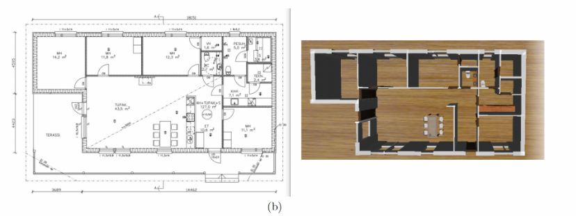
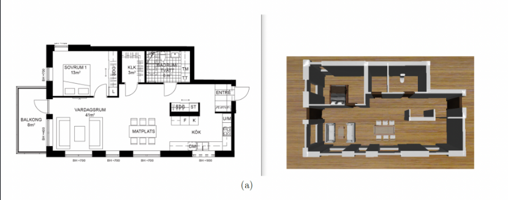

# FloorPlanTo3D: The Next Dimension in Architectural Visualization

<p align="center">
  
</p>

## 🏗️ Overview

**FloorPlanTo3D** introduces an innovative approach to transform 2D floor plan images into customizable, interactive 3D models. The system leverages deep learning and AI to automatically detect architectural elements such as walls, doors, and windows, then generates photorealistic 3D visualizations that can be customized according to your preferences.

### Key Features

- **🤖 AI-Powered Detection**: Uses Mask R-CNN deep learning model to automatically detect walls, windows, and doors from 2D floor plan images
- **🎨 Photorealistic Rendering**: Generates stunning 3D visualizations with realistic textures and lighting using Google Gemini AI
- **🪑 Intelligent Furniture Placement**: Automatically places furniture in detected rooms or customize placement manually
- **📐 Precise 3D Model Generation**: Creates accurate GLB 3D models that can be viewed in any compatible viewer
- **🌐 Web-Based Interface**: User-friendly web application for uploading floor plans and viewing results
- **⚡ Fast Processing**: Optimized pipeline for quick 2D to 3D conversion
- **🔧 Customizable**: Modify room layouts, furniture, and styling options to match your vision

<p align="center">
  
</p>

## 🚀 How It Works

1. **Upload Floor Plan**: Users select and upload a 2D floor plan image (PNG, JPG, etc.)
2. **AI Analysis**: The Mask R-CNN model analyzes the image and detects architectural elements
3. **Structure Detection**: Walls, windows, and doors are identified and extracted with precise coordinates
4. **Furniture Detection**: Gemini AI analyzes the rendered floor plan to detect and place furniture items
5. **3D Generation**: The system generates a complete 3D GLB model with textures and furniture
6. **Visualization**: View and interact with the 3D model in the built-in viewer
7. **Customization**: Adjust furniture placement, styling, and other parameters as needed

## 🛠️ Technology Stack

### Backend
- **Python 3.10+**: Core programming language
- **Flask**: Web framework for API endpoints
- **TensorFlow 2.17**: Deep learning framework
- **Mask R-CNN**: Instance segmentation for architectural element detection
- **Google Gemini AI**: Photorealistic rendering and furniture detection
- **Trimesh**: 3D model generation and manipulation

### Frontend
- **HTML5/CSS3**: Modern web interface
- **JavaScript**: Interactive viewer and controls
- **Three.js**: 3D model rendering and visualization

### AI Models
- **Mask R-CNN**: Trained on architectural floor plan dataset for wall, window, and door detection
- **Google Gemini**: Multi-modal AI for image generation and object detection

## 📦 Installation

### Prerequisites

- Python 3.10 or higher
- pip (Python package manager)
- Git
- Google Gemini API key (for AI rendering features)

### Setup Instructions

1. **Clone the repository**
   ```bash
   git clone https://github.com/Vijaykrishna2334/FloorPlanTo3D.git
   cd FloorPlanTo3D
   ```

2. **Create and activate virtual environment**
   ```bash
   # Windows
   python -m venv .venv
   .venv\Scripts\activate
   
   # Linux/Mac
   python3 -m venv .venv
   source .venv/bin/activate
   ```

3. **Install dependencies**
   ```bash
   pip install -r requirements.txt
   ```

4. **Configure environment variables**
   
   Create a `.env` file in the root directory:
   ```env
   GEMINI_API_KEY=your_gemini_api_key_here
   ```

5. **Download model weights**
   
   The Mask R-CNN trained weights are required for 2D detection.
   - Download `maskrcnn_15_epochs.h5` from [Your Download Link Here]
   - Place the file in the `weights/` directory:
   ```
   weights/maskrcnn_15_epochs.h5
   ```

6. **Run the application**
   ```bash
   python application.py
   ```

   The server will start at `http://localhost:5000`

## 🎯 Usage

### Using the Web Interface

1. Open your browser and navigate to `http://localhost:5000`
2. Click "Upload Floor Plan" and select your 2D floor plan image
3. Click "Analyze" to detect architectural elements
4. Review the detected walls, windows, and doors
5. Click "Generate 3D Model" to create the GLB file
6. View and interact with the 3D model in the viewer

### API Endpoints

#### 1. Predict Structural Elements
```http
POST /predict
Content-Type: multipart/form-data

image: <floor_plan_image_file>
```

**Response:**
```json
{
  "points": [
    {"x1": 100, "y1": 50, "x2": 500, "y2": 55}
  ],
  "classes": [
    {"name": "wall"}
  ],
  "Width": 800,
  "Height": 600,
  "averageDoor": 90.5
}
```

#### 2. Complete Detection (Structure + Furniture)
```http
POST /detect-complete
Content-Type: multipart/form-data

image: <floor_plan_image_file>
```

**Response:**
```json
{
  "success": true,
  "structures": { ... },
  "furniture": [
    {
      "name": "sofa",
      "x": 0.5,
      "y": 0.3,
      "width": 180,
      "depth": 90,
      "rotation": 0,
      "room": "living_room"
    }
  ],
  "message": "Detected 15 structures and 8 furniture items"
}
```

#### 3. Generate Photorealistic Render
```http
POST /generate-render
Content-Type: multipart/form-data

image: <floor_plan_image_file>
```

**Response:**
```json
{
  "success": true,
  "render_path": "generated_render.png",
  "message": "Photorealistic render generated successfully"
}
```

#### 4. Generate 3D GLB Model
```http
POST /generate-glb
```

**Response:**
Downloads the generated `floorplan_3d.glb` file

#### 5. Download GLB File
```http
GET /output.glb
```

Returns the generated 3D model file

## 📁 Project Structure

```
FloorPlanTo3D-API-abhi/
├── application.py              # Main Flask application
├── generate_glb_model.py       # 3D model generation
├── gemini_render.py           # Gemini AI integration
├── create_furniture_assets.py # Furniture model creation
├── requirements.txt           # Python dependencies
├── runtime.txt               # Python version specification
├── .env                      # Environment variables (not in repo)
├── weights/                  # Model weights directory
│   └── maskrcnn_15_epochs.h5
├── mrcnn/                    # Mask R-CNN implementation
│   ├── config.py
│   ├── model.py
│   └── utils.py
├── assets/                   # 3D assets and textures
├── images/                   # Static images
│   └── readme/              # README documentation images
└── index.html               # Main web interface
```

## 🎨 Supported Floor Plan Types

- **Standard architectural drawings**: CAD exports, blueprint scans
- **Hand-drawn floor plans**: Sketches with clear wall boundaries
- **Mixed drawings**: Combination of printed and hand-drawn elements
- **Image formats**: PNG, JPG, JPEG, BMP

## ⚙️ Configuration

### Model Configuration

Modify parameters in `application.py`:

```python
class PredictionConfig(Config):
    NAME = "floorPlan_cfg"
    NUM_CLASSES = 1 + 3  # background + wall, window, door
    GPU_COUNT = 1
    IMAGES_PER_GPU = 1
```

### Rendering Styles

Available styles for photorealistic rendering:
- `scandinavian_minimalist`
- `modern_contemporary`
- `traditional_classic`
- `industrial_loft`

## 🔍 Troubleshooting

**Issue**: Model weights not found
- **Solution**: Ensure `maskrcnn_15_epochs.h5` is in the `weights/` directory

**Issue**: Gemini API errors
- **Solution**: Verify your API key is correctly set in the `.env` file

**Issue**: Low detection accuracy
- **Solution**: Ensure floor plan has clear, high-contrast walls and proper lighting

**Issue**: Memory errors during 3D generation
- **Solution**: Reduce image size or simplify the floor plan

## 📄 License

This project is licensed under the MIT License - see the [LICENSE](LICENSE) file for details.

## 🤝 Contributing

Contributions are welcome! Please feel free to submit a Pull Request.

1. Fork the repository
2. Create your feature branch (`git checkout -b feature/AmazingFeature`)
3. Commit your changes (`git commit -m 'Add some AmazingFeature'`)
4. Push to the branch (`git push origin feature/AmazingFeature`)
5. Open a Pull Request

## 📧 Contact

**Project Maintainer**: Vijaykrishna2334

**Repository**: [https://github.com/Vijaykrishna2334/FloorPlanTo3D](https://github.com/Vijaykrishna2334/FloorPlanTo3D)

## 🙏 Acknowledgments

- Mask R-CNN implementation based on [Matterport's Mask_RCNN](https://github.com/matterport/Mask_RCNN)
- Google Gemini AI for photorealistic rendering capabilities
- TensorFlow and Keras teams for the deep learning framework
- Contributors and users who have helped improve this project

---

<p align="center">
  Made with ❤️ for architects, designers, and visualization enthusiasts
</p>